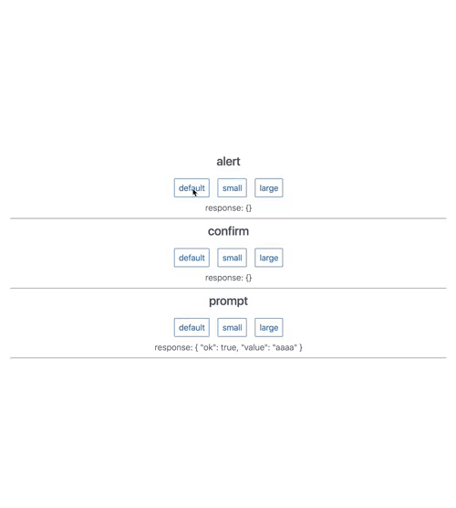
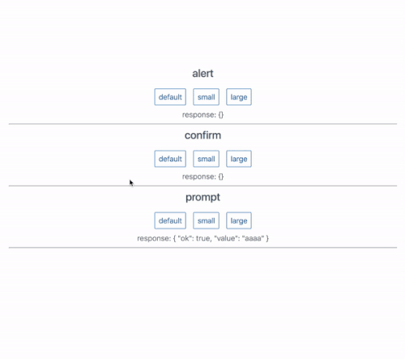
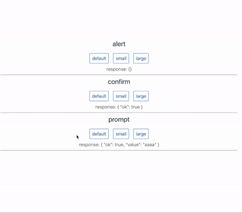

# v-slim-dialog

## Slim Dialog for Vuejs

## Installation

```bash
yarn add v-slim-dialog
# Or using npm
npm install v-slim-dialog --save
```

# Usage

```js
import Vue from 'vue'

import 'v-slim-dialog/dist/v-slim-dialog.css'
import SlimDialog from 'v-slim-dialog'

Vue.use(SlimDialog)
```

## Options params

| Name        | Type               | Required | Default value | Info                                                 |
| ----------- | ------------------ | -------- | ------------- | ---------------------------------------------------- |
| title       | String             | No       |               | Title of modal                                       |
| okLabel     | String             | No       | OK            | Label of button OK                                   |
| cancelLabel | String             | No       | Cancel        | Label of button cancel                               |
| size        | String('sm'or'lg') | No       |               | Size of modal                                        |
| prompt      | Object             | No       |               | Hash for prompt {value: '', component: VueComponent} |

## In your component

### alert

```js
//...
methods: {
  /**
   * @param String message
   * @param Object options default { title, okLabel = 'OK', size }
   */
  showAlert() {
    const options = {title: 'Info', size: 'sm'}
    this.$dialogs.alert('Your message', options)
    .then(res => {
      console.log(res) // {ok: true|false|undefined}
    })
  }
}
//...
```



### confirm

```js
//...
methods: {
  /**
   * @param String message
   * @param Object options default { title, cancelLabel = 'Cancel', okLabel = 'OK', size }
   */
  showConfirm() {
    const options = {title: 'Confirm?', cancelLabel: 'No'}
    this.$dialogs.confirm('Your message!', options)
    .then(res => {
      console.log(res) // {ok: true|false|undefined}
    })
  }

}
//...
```



### prompt

```js
//...
methods: {
  /**
   * @param String message
   * @param Object options default { title, okLabel = 'OK', size, prompt }
   */
  showPrompt() {
    const options = {title: 'Continue?', okLabel: 'Continue'}
    this.$dialogs.prompt('Your message!', options)
    .then(res => {
      console.log(res) // {value: 'user input', ok: true|false|undefined}
    })

    // with custom input prompt
    const options = {title: 'Continue?', prompt: {component: 'cpf-cnpj'}}
    this.$dialogs.prompt('Your message!', options)
    .then(res => {
      console.log(res) // {value: 'user input', ok: true|false|undefined}
    })

    // or
    import YourComponent from './YourComponent'
    const options = {title: 'Continue?', prompt: {component: YourComponent}}
    this.$dialogs.prompt('Your message!', options)
    .then(res => {
      console.log(res) // {value: 'user input', ok: true|false|undefined}
    })

  }

}
//...
```



## Sample custom prompt Component

This is the default component if you do not report

```html
<template>
  <input v-model='model'>
</template>

<script>
export default {
  props: {
    value: [Number, String]
  },

  computed: {
    model: {
      get() {
        return this.value
      },
      set(v) {
        this.$emit('input', v)
      }
    }
  },
  mounted() {
    this.$el.focus()
  }
}
</script>
```

## Development

```bash
# install dependencies
yarn install

# build with minification
yarn release

# publish
bin/publish
```
